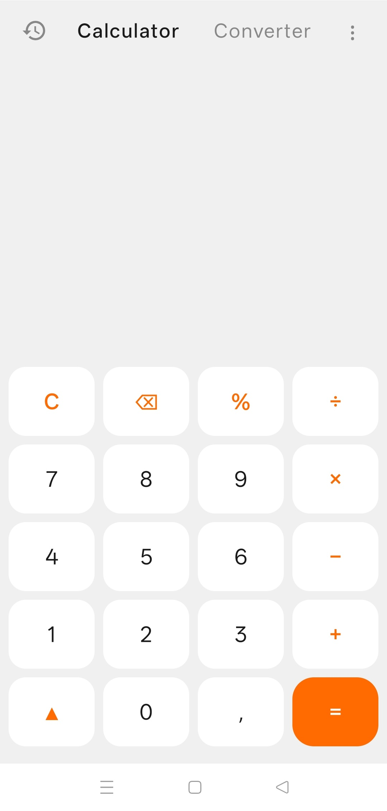
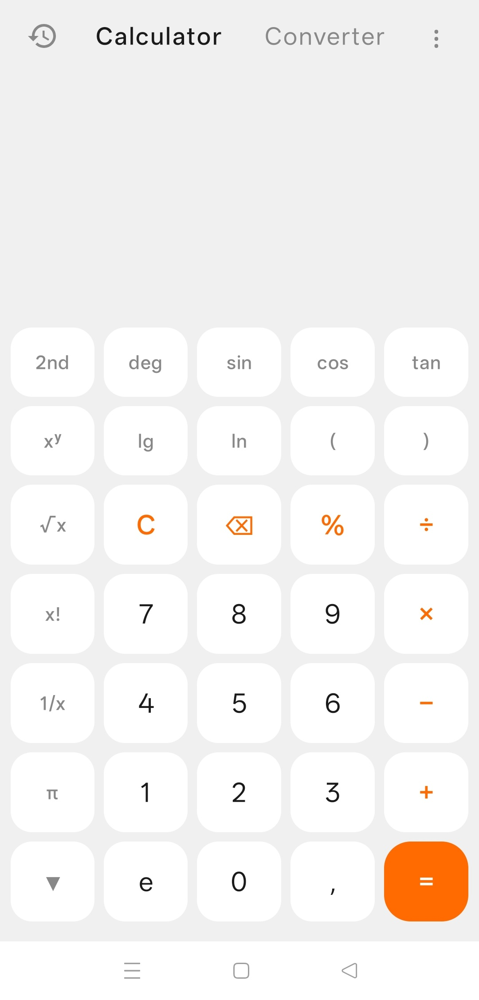
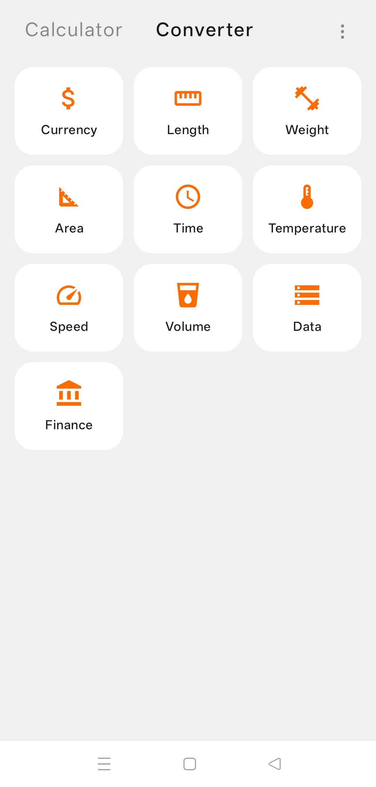
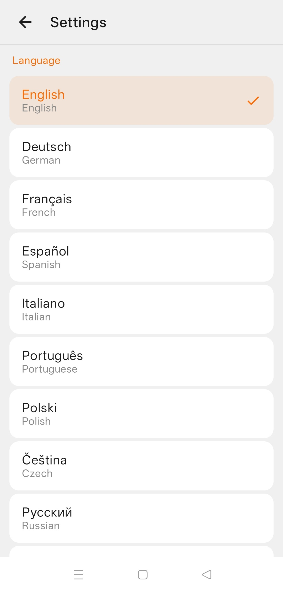

# Calculator App

Modern Android calculator application with unit converter, built with Jetpack Compose and Material 3.

## Features

- **Calculator**:
    - Standard arithmetic operations.
    - Scientific mode with trigonometric functions (sin, cos, tan), logarithms (lg, ln), constants (π, e), factorial (x!), square root (√x), and more.
    - Calculation history.
- **Converter** — unit conversion across multiple categories:
    - Currency (with internet update support).
    - Length, Weight, Area, Volume, Speed, Temperature, Time, Data, Finance.
- **Settings** — language selection, haptic feedback control.
- **Localization**: Multi-language interface — English, Russian, German, French, Spanish, Italian, Portuguese, Polish, Czech, Chinese.
- **Modern UI**: Fully implemented in Jetpack Compose following Material 3 guidelines.

## Screenshots

| Calculator | Calculator Scientific |
|:---:|:---:|
|  |  |

| Converter | Settings |
|:---:|:---:|
|  |  |

## Technical Stack

- **Language**: Kotlin
- **UI Framework**: Jetpack Compose + Material 3
- **Architecture**: MVVM (ViewModel + StateFlow)
- **Navigation**: Navigation Compose
- **Storage**: DataStore Preferences
- **Haptic feedback**: VibratorManager (composition primitives)

## Prerequisites

- **JDK 17+**: Required for modern Gradle and Android build tools.
- **Android Studio**: Meerkat or later recommended.
- **Android SDK**:
    - Min SDK: 36
    - Target SDK: 36

## Build and Run

1. Clone the repository: `git clone <repository-url>`
2. Open the project in Android Studio.
3. Sync Gradle and build the project.
4. Run on an emulator or a physical device (API 36+).

### Command Line Build

To build the debug APK:
```bash
# On Unix-like systems (Linux, macOS)
./gradlew assembleDebug

# On Windows
.\gradlew.bat assembleDebug
```
The output APK will be located at `app/build/outputs/apk/debug/app-debug.apk`.

To build the release APK:
```bash
# On Unix-like systems (Linux, macOS)
./gradlew assembleRelease

# On Windows
.\gradlew.bat assembleRelease
```
The output APK will be located at `app/build/outputs/apk/release/app-release.apk`.

To run unit tests:
```bash
./gradlew test
```

To run static analysis (Lint):
```bash
./gradlew lint
```

## Localization

The app supports multiple languages. Strings are located in `app/src/main/res/values-*/strings.xml`. To contribute a new translation, create a new `values-<lang>` folder and add `strings.xml`.

## MIT License

Calculator application is completely free and released under the [MIT License](./LICENSE).

## Author

Created by [Vladimir Danilov](https://github.com/danilovl).
